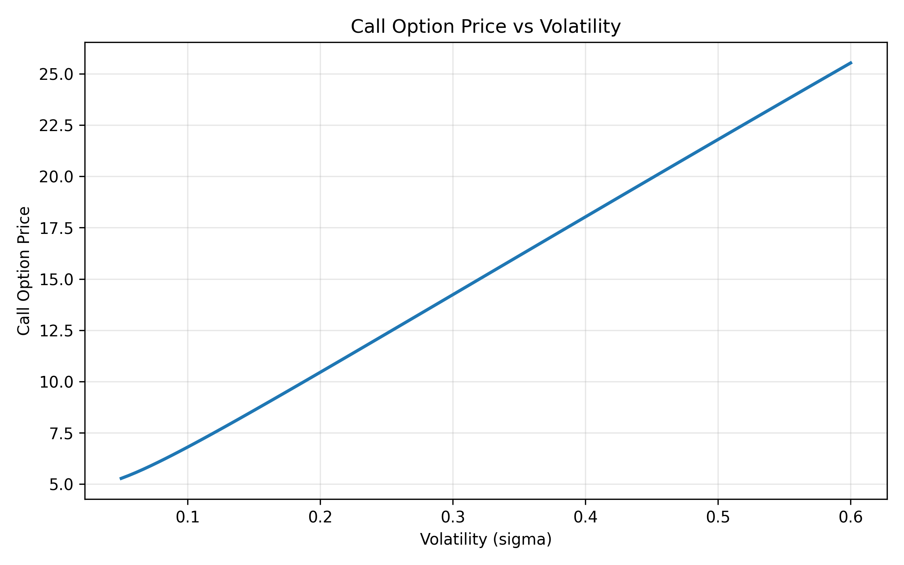

# Black-Scholes Sensitivity Lab

A Python project for pricing European call and put options with the Black-Scholes model and analyzing parameter sensitivity through the Greeks.

## Overview

This project began as a single Python script (`black-scholes.py`) for computing Black-Scholes option prices and core Greeks for European options. I later refactored it into a structured GitHub repository with modular files for pricing, Greeks, utilities, testing, and visualization to make the project easier to maintain, validate, and extend.

## Features

- Black-Scholes pricing for European call and put options
- Greeks-based sensitivity analysis
- Modular Python code structure
- Automated test coverage for pricing correctness
- Visualization support for model behavior and parameter sensitivity
- Refactored from a single-file prototype into a cleaner project layout

## Repository structure

```text
black-scholes-sensitivity-lab/
├── README.md
├── LICENSE
├── .gitignore
├── requirements.txt
├── main.py
├── src/
│   ├── __init__.py
│   ├── pricing.py
│   ├── greeks.py
│   ├── utils.py
│   └── visualization.py
├── tests/
│   └── test_pricing.py
├── notebooks/
└── figures/
    └── call_price_vs_volatility.png
```

## Tech stack

- Python
- NumPy
- SciPy
- Matplotlib
- Pytest

## Getting started

Clone the repository:

```bash
git clone https://github.com/YOUR-USERNAME/black-scholes-sensitivity-lab.git
cd black-scholes-sensitivity-lab
```

Install dependencies:

```bash
python3 -m pip install -r requirements.txt
```

## Running the project

Run the command-line version:

```bash
python3 main.py
```

Run the test suite:

```bash
python3 -m pytest
```

Generate the volatility sensitivity plot:

```bash
python3 -m src.visualization
```

## Example output

The figure below shows how the Black-Scholes call option price changes as volatility increases while the other model inputs are held fixed. The upward trend is consistent with the model’s sensitivity to volatility.



## Current status

The project has been migrated from a single-file prototype into a modular repository with pricing logic, Greeks calculations, testing, and visualization support. This version is meant to serve as a stronger foundation for future quantitative finance experiments and extensions.

## Planned improvements

- Add additional Greeks visualizations
- Add more unit tests for pricing and risk metrics
- Add notebooks for experimentation and demonstrations
- Add implied volatility estimation
- Compare analytical Black-Scholes pricing with Monte Carlo methods

## Author

Gautam Deshmukh
